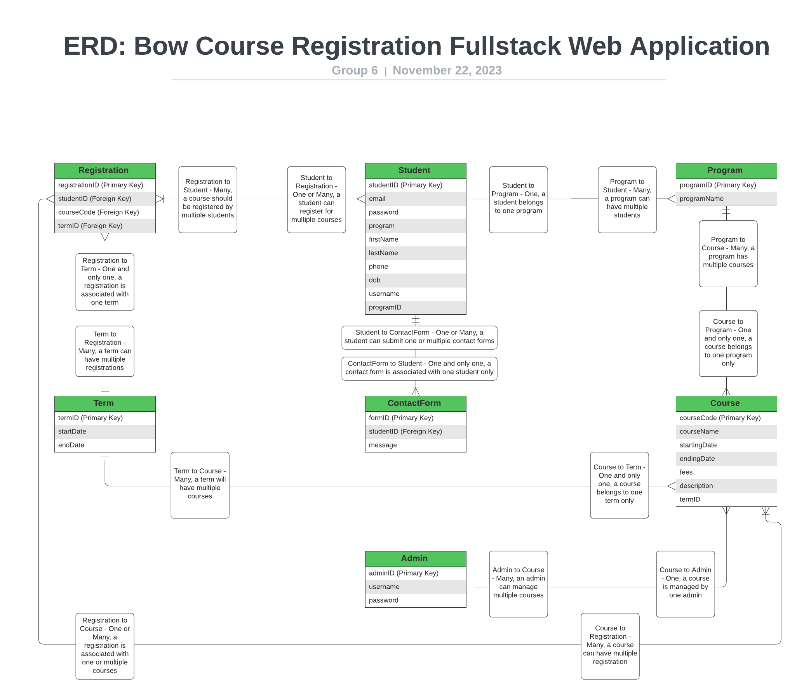

# Bow Online Course Registration System

This is the backend code for the Bow Online Course Registration System. This system is designed to allow students to register for courses online, and for administrators to manage the courses and students.

## ERD Diagram for the Database



## Project Structure
```bash
/Backend
    /public
        BowCourseRegistration-ERD-Backend.png 
    /sql
        BowCourseRegistrationSQL.sql
    /src
            /routers
                admin-router.js
                student-router.js
        db.js
        server.js
    package.json
    README.md
```

## Database Setup

To set up the database, follow this steps:

Run the BowCourseRegistration.sql file in the sql folder
Create table and insert data into each table

## Installation

1. Clone the repository

```bash
git clone git@github.com:BowCourseRegistration/Backend.git
cd Backend
```

2. Install dependencies

```bash
npm install
```

3. Run the server

```bash
npm start
```


